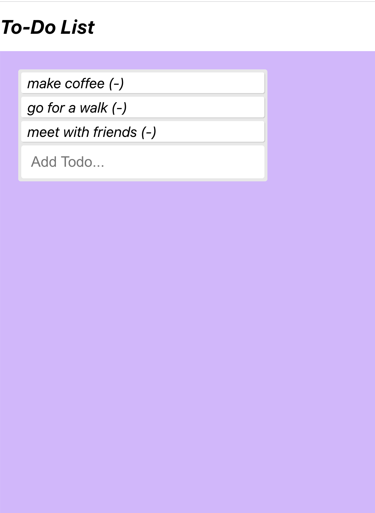

# To-Do List

## Description Of The Project:
Create and remove your to-dos as they are done

## How To Run:
1. Download files to your local machine
2. Run http server
3. Go to browser to local server
4. Add a new task, remove it by clicking on it when done

## Roadmap Of Future Improvements:
1. Add more styles
2. Add undo option 

## License Information:
MIT License

